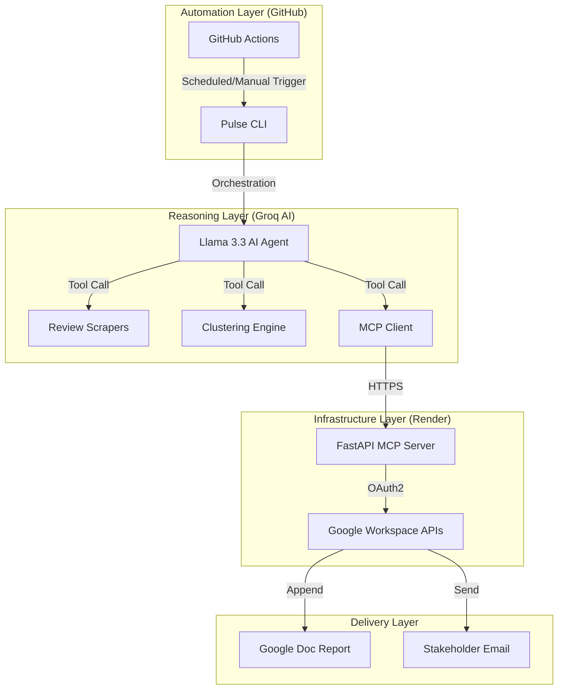

# Weekly Product Review Pulse - Workflow Summary

This document provides a high-level overview of the automated AI pipeline designed to monitor product reviews and deliver summarized insights.

## 🏗️ System Architecture

## 🔄 Step-by-Step Workflow

1.  **Initiation**: GitHub Actions triggers the `weekly_pulse.yml` workflow every Tuesday at 09:30 AM IST.
2.  **Ingestion**: The AI Agent uses the `fetch_all_reviews` tool to scrape the most recent feedback from the Apple App Store and Google Play Store.
3.  **Intelligence**:
    *   **PII Scrubbing**: Removes sensitive user data (names, emails, phones).
    *   **Semantic Clustering**: Uses Scikit-Learn (TF-IDF & UMAP) to group reviews into logical themes (e.g., "Login Issues", "Feature Requests").
4.  **Synthesis**: The LLM (Llama 3.3 70B) analyzes the clusters and writes a professional Markdown report including verbatim quotes and actionable product recommendations.
5.  **Secure Delivery**:
    *   The `MCP Client` sends the report to a private FastAPI server hosted on **Render**.
    *   The server uses encrypted **OAuth2 credentials** to securely update the centralized Google Doc and dispatch the summary email to stakeholders.

## 🛡️ Security & Reliability
- **Idempotency**: A local SQLite database ensures that duplicate reports are never sent for the same week.
- **Secure Secrets**: All API keys and Google tokens are stored in encrypted GitHub Secrets and Render Environment Variables.
- **Error Handling**: Robust retry logic and "dummy expiry" bypasses ensure the system survives Google API credential rotations.

---
**Status**: ACTIVE | **Last Verified**: 2026-05-06
